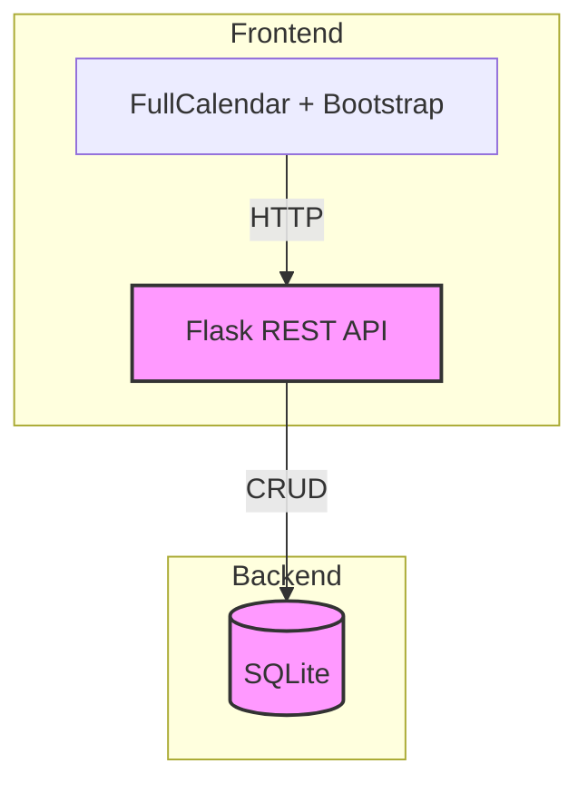

# Calendario Interactivo – Documentación Técnica

## Visión General del Proyecto
El proyecto es una aplicación web de calendario que permite crear, leer, actualizar y eliminar eventos a través de una interfaz gráfica basada en **FullCalendar** y un backend construido con **Flask** y **SQLAlchemy**.  
- El frontend está compuesto por un único `index.html` que incluye Bootstrap 5 para estilos y FullCalendar para la visualización del calendario.  
- El backend expone una API REST bajo el prefijo `/api`, gestionando eventos persistentes en una base de datos SQLite.  
- Los tests unitarios utilizan Pytest y configuran una base de datos en memoria para validar las operaciones CRUD.

## Arquitectura del Sistema


### Componentes Clave
| Componente | Responsabilidad | Tecnologías |
|------------|-----------------|-------------|
| **`app.py`** | Arranque de la aplicación Flask y creación automática de tablas. | Flask |
| **`config.py`** | Configuración central (URI de SQLite, tracking). | Python/OS |
| **`models.py`** | Definición del modelo `Evento`. | SQLAlchemy |
| **`routes.py`** | Endpoints CRUD (`GET`, `POST`, `PUT`, `DELETE`). | Flask Blueprint |
| **Frontend** | Renderizado de calendario y manejo de eventos. | HTML, Bootstrap 5, FullCalendar JS |

## Endpoints de la API

| Método | Ruta | Parámetros | Descripción | Respuesta |
|--------|------|------------|-------------|-----------|
| `GET` | `/api/events` | `start`, `end` (opcional) | Lista eventos filtrados por rango. | `200 OK` – lista JSON de eventos |
| `POST` | `/api/events` | Cuerpo JSON (`titulo`, `fecha_inicio`, `fecha_fin`, opcionales `descripcion`, `color`) | Crea un nuevo evento. | `201 Created` – evento creado |
| `PUT` | `/api/events/<int:event_id>` | Cuerpo JSON con campos a actualizar | Actualiza el evento especificado. | `200 OK` – evento actualizado |
| `DELETE` | `/api/events/<int:event_id>` | - | Elimina el evento. | `200 OK` – mensaje de confirmación |

### Ejemplo de Payload
```json
{
  "titulo": "Reunión",
  "descripcion": "Discusión sobre proyecto X",
  "fecha_inicio": "2025-08-20T10:00:00",
  "fecha_fin": "2025-08-20T11:00:00",
  "color": "#ff0000"
}
```

## Instrucciones de Instalación y Ejecución
1. **Clonar el repositorio**  
   ```bash
   git clone https://github.com/usuario/calendario-interactivo.git
   cd calendario-interactivo
   ```
2. **Crear entorno virtual (opcional pero recomendado)**  
   ```bash
   python -m venv .venv
   source .venv/bin/activate  # Windows: .venv\Scripts\activate
   ```
3. **Instalar dependencias**  
   ```bash
   pip install -r requirements.txt
   ```
4. **Inicializar la base de datos y arrancar el servidor**  
   ```bash
   python backend/app.py
   ```
5. **Abrir en navegador**  
   Navegar a `http://localhost:5000/` para ver el calendario interactivo.

## Flujo de Datos Clave

1. **Creación de Evento**  
   - Usuario rellena formulario → POST `/api/events` → Flask recibe JSON, valida y guarda en SQLite → Responde con evento creado → Frontend actualiza vista.

2. **Lectura de Eventos**  
   - Frontend hace GET `/api/events?start=YYYY-MM-DD&end=YYYY-MM-DD` → Flask consulta DB → Devuelve lista JSON → FullCalendar renderiza eventos.

3. **Actualización (drag & drop)**  
   - Usuario arrastra evento → `eventDrop` dispara PUT `/api/events/<id>` con nuevas fechas → Backend actualiza registro → Frontend recarga eventos para reflejar cambios.

4. **Eliminación**  
   - Usuario pulsa “Eliminar” en modal → DELETE `/api/events/<id>` → Flask elimina y confirma → Frontend refresca calendario.

## Extensiones Futuras (Opcional)
- **Autenticación JWT**: Añadir login/logout y proteger endpoints con tokens.
- **Eventos recurrentes**: Soporte para eventos que se repiten semanalmente/mensualmente.
- **Notificaciones por email**: Enviar recordatorios antes de la fecha de inicio.
- **Persistencia en PostgreSQL**: Migrar a base de datos más robusta para producción.
- **UI/UX mejorado**: Implementar filtros, búsqueda y vista de agenda.