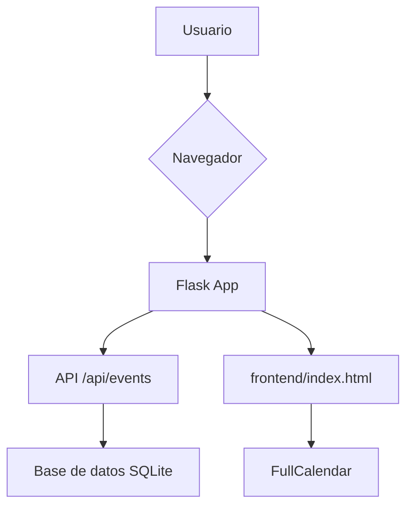
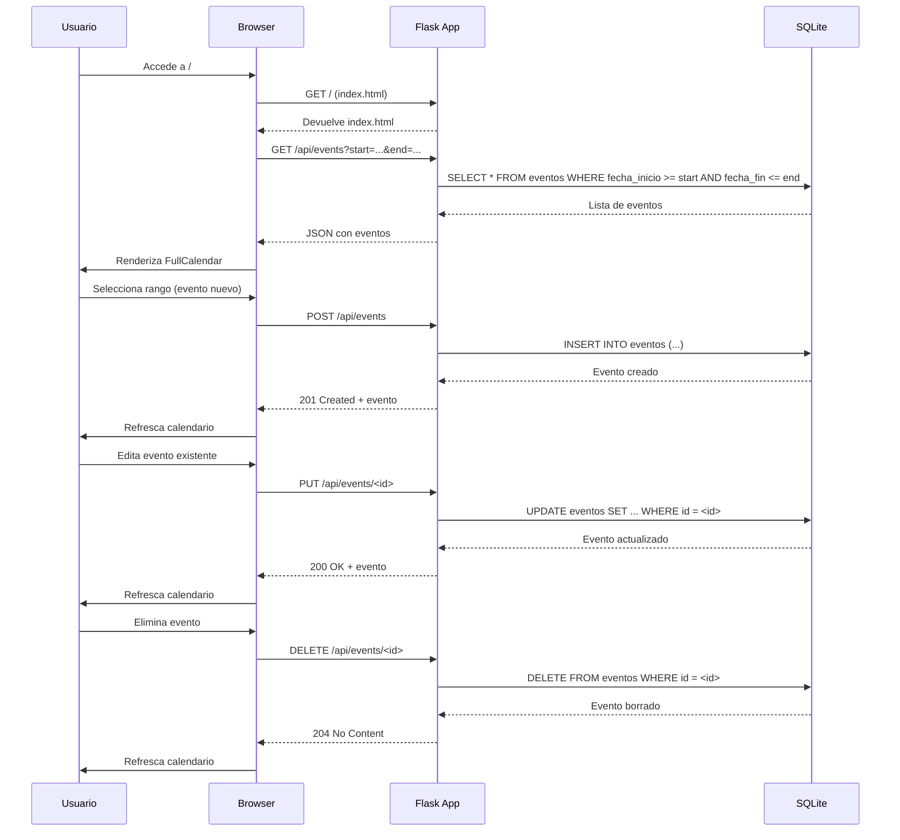

# Visión General del Proyecto

Este proyecto es una aplicación web sencilla que permite crear, consultar y administrar eventos dentro de un calendario interactivo.  
El backend está construido con **Flask** y utiliza **SQLite** como base de datos a través de **SQLAlchemy**. El frontend emplea **FullCalendar** junto con Bootstrap 5 para ofrecer una experiencia visual atractiva y responsiva.

- **Backend**: RESTful API que expone endpoints `/api/events` para operaciones CRUD sobre la entidad `Evento`.  
- **Frontend**: Página única (`index.html`) que consume la API, muestra los eventos en un calendario y permite crear/editar/eliminar eventos mediante modales.  
- **Persistencia**: Una base de datos SQLite llamada `calendario.db`, creada automáticamente si no existe.

El flujo de trabajo típico es:

1. El usuario abre la aplicación (index.html).  
2. La página solicita los eventos del mes actual a `/api/events`.  
3. Los eventos se renderizan en FullCalendar.  
4. Al seleccionar o hacer clic sobre un evento, el modal permite crear o editar el registro.  
5. Cada acción dispara una petición HTTP correspondiente al endpoint adecuado.

---

# Arquitectura del Sistema

## Componentes principales

| Componente | Descripción |
|------------|-------------|
| **Flask App** | Punto de entrada (`app.py`) que ejecuta la aplicación en modo debug. |
| **Blueprint `api_bp`** | Agrupa los endpoints REST bajo el prefijo `/api`. |
| **Modelo `Evento`** | Representa un evento con campos: id, titulo, descripcion, fecha_inicio, fecha_fin y color. |
| **Base de datos SQLite** | Persistencia local; esquema generado por SQLAlchemy. |
| **Frontend (index.html)** | SPA que consume la API y renderiza el calendario. |

## Diagrama Mermaid



---

# Endpoints de la API

| Método | Ruta | Parámetros | Descripción | Respuesta |
|--------|------|------------|-------------|-----------|
| `GET` | `/api/events` | `start`, `end` (opcional, ISO 8601) | Devuelve todos los eventos, opcionalmente filtrados por rango de fechas. | `200 OK` con lista JSON de eventos. |
| `POST` | `/api/events` | Cuerpo JSON (`titulo`, `fecha_inicio`, `fecha_fin`, opcional `descripcion`, `color`) | Crea un nuevo evento. | `201 Created` con el objeto creado. |
| `PUT` | `/api/events/<int:event_id>` | Cuerpo JSON (cambios parciales) | Actualiza los campos de un evento existente. | `200 OK` con el objeto actualizado. |
| `DELETE` | `/api/events/<int:event_id>` |  | Elimina el evento especificado. | `204 No Content`. |

## Ejemplos de peticiones

```bash
# Obtener eventos del mes actual
curl -X GET "http://localhost:5000/api/events?start=2024-08-01&end=2024-08-31"

# Crear un nuevo evento
curl -X POST http://localhost:5000/api/events \
     -H 'Content-Type: application/json' \
     -d '{"titulo":"Reunión","fecha_inicio":"2024-08-15T10:00:00","fecha_fin":"2024-08-15T11:00:00"}'

# Actualizar título
curl -X PUT http://localhost:5000/api/events/1 \
     -H 'Content-Type: application/json' \
     -d '{"titulo":"Reunión actualizada"}'
```

---

# Instrucciones de Instalación y Ejecución

1. **Clonar el repositorio**  
   ```bash
   git clone https://github.com/tu-usuario/calendario-interactivo.git
   cd calendario-interactivo
   ```

2. **Crear entorno virtual (opcional pero recomendado)**  
   ```bash
   python -m venv venv
   source venv/bin/activate      # Windows: venv\Scripts\activate
   ```

3. **Instalar dependencias**  
   ```bash
   pip install -r requirements.txt
   ```

4. **Crear la base de datos (solo la primera vez)**  
   ```bash
   python migrate_db.py
   ```

5. **Ejecutar la aplicación**  
   ```bash
   python app.py
   ```
   La API estará disponible en `http://localhost:5000/api/` y el frontend en `http://localhost:5000/`.

6. **Ejecutar pruebas unitarias**  
   ```bash
   pytest tests/test_backend.py
   ```

---

# Flujo de Datos Clave



---

# Extensiones Futuras (Opcional)

| Área | Posible Mejora | Beneficio |
|------|----------------|-----------|
| **Autenticación** | Añadir JWT o sesiones para restringir acceso a la API. | Seguridad y control de usuarios. |
| **Persistencia en producción** | Migrar SQLite a PostgreSQL/MySQL con Alembic. | Escalabilidad y concurrencia mejorada. |
| **Notificaciones** | WebSocket (Flask-SocketIO) o email para recordatorios. | Mejor experiencia del usuario. |
| **Exportación** | Endpoints `/api/events/export` que devuelvan CSV/ICS. | Interoperabilidad con otros calendarios. |
| **Pruebas de integración** | Cypress o Playwright para UI. | Garantizar la correcta interacción frontend-backend. |

---