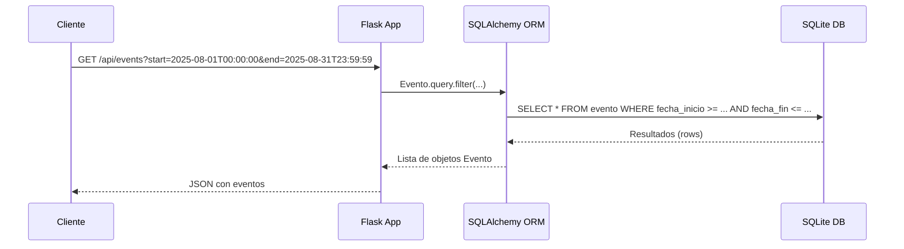

# Visión General del Proyecto
Este proyecto es un **backend de calendario** construido con Flask y SQLAlchemy, diseñado para gestionar eventos a través de una API RESTful. La aplicación expone endpoints que permiten crear, leer, actualizar y eliminar (CRUD) eventos, así como filtrar los eventos por rango de fechas. El frontend se sirve desde la carpeta `frontend` mediante el punto raíz `/`, mientras que toda la lógica de negocio reside en Python.

El modelo principal es **Evento**, con campos típicos de un calendario: título, descripción, fechas de inicio y fin, y color de visualización. Los datos se serializan a JSON para facilitar su consumo por clientes web o móviles.

---

# Arquitectura del Sistema
## Componentes Principales
| Componente | Responsabilidad |
|------------|-----------------|
| **Flask** | Servidor HTTP que expone la API y sirve el frontend estático. |
| **SQLAlchemy** | ORM que mapea la tabla `evento` a la clase `Evento`. |
| **SQLite** | Motor de base de datos ligero, almacenado en `calendario.db`. |
| **Blueprint `events_bp`** | Agrupa las rutas relacionadas con eventos bajo el prefijo `/api`. |

## Diagrama de Flujo
```mermaid
flowchart TD
    A[Cliente HTTP] --> B[Flask App]
    B --> C{Rutas}
    C --> D[/api/events (GET)]
    C --> E[/api/events (POST)]
    C --> F[/api/events/<id> (PUT)]
    C --> G[/api/events/<id> (DELETE)]
    B --> H[SQLAlchemy ORM]
    H --> I[SQLite DB: calendario.db]
```

---

# Endpoints de la API
## Tabla de Rutas

| Método | Ruta | Parámetros | Descripción | Respuesta |
|--------|------|------------|-------------|-----------|
| `GET` | `/api/events` | `start`, `end` (query) | Obtiene eventos dentro del rango. | `200 OK`: Lista de eventos en JSON. |
| `POST` | `/api/events` | Body JSON (`titulo`, `fecha_inicio`, `fecha_fin`, opcionales `descripcion`, `color`) | Crea un nuevo evento. | `201 Created`: Evento creado. |
| `PUT` | `/api/events/<int:event_id>` | Body JSON (cualquier campo del modelo) | Actualiza el evento especificado. | `200 OK`: Evento actualizado. |
| `DELETE` | `/api/events/<int:event_id>` | Ninguno | Elimina el evento. | `200 OK`: Mensaje de éxito. |

## Esquema de Respuesta
```json
{
  "id": 1,
  "titulo": "Reunión",
  "descripcion": "Discusión sobre proyecto X",
  "fecha_inicio": "2025-08-15T10:00:00",
  "fecha_fin": "2025-08-15T11:00:00",
  "color": "#FF0000"
}
```

## Manejo de Errores
| Código | Condición | Mensaje |
|--------|-----------|---------|
| `400 Bad Request` | Formato de fecha inválido o campos obligatorios faltantes. | `{ "error": "Solicitud inválida" }` |
| `404 Not Found` | Evento no encontrado. | `{ "error": "Recurso no encontrado" }` |
| `500 Internal Server Error` | Excepciones inesperadas. | `{ "error": "Error interno del servidor" }` |

---

# Instrucciones de Instalación y Ejecución
1. **Clonar el repositorio**  
   ```bash
   git clone https://github.com/tuusuario/calendario-backend.git
   cd calendario-backend
   ```

2. **Crear entorno virtual**  
   ```bash
   python3 -m venv .venv
   source .venv/bin/activate  # Windows: .venv\Scripts\activate
   ```

3. **Instalar dependencias**  
   ```bash
   pip install -r requirements.txt
   ```
   *(Si no existe `requirements.txt`, crear con:)*  
   ```text
   Flask==2.3.*
   Flask-SQLAlchemy==3.0.*
   ```

4. **Inicializar la base de datos**  
   ```bash
   python
   >>> from app import create_app, db
   >>> app = create_app()
   >>> with app.app_context():
   ...     db.create_all()
   ...
   ```
   *(O bien usar un script de migración si se añade Alembic.)*

5. **Ejecutar la aplicación**  
   ```bash
   flask run --app app:create_app
   ```
   La API estará disponible en `http://127.0.0.1:5000/api/events` y el frontend en `http://127.0.0.1:5000/`.

---

# Flujo de Datos Clave


---

# Extensiones Futuras (Opcional)

1. **Autenticación JWT**  
   Añadir un sistema de login y tokens para proteger los endpoints, permitiendo que solo usuarios autenticados creen/editen/eliminan eventos.

2. **Manejo de Usuarios**  
   Crear un modelo `Usuario` con roles (admin, editor) y asociar cada evento a su creador.

3. **Notificaciones**  
   Integrar WebSocket o email para avisar a los usuarios sobre cambios en sus eventos.

4. **Paginar resultados**  
   Implementar parámetros `page` y `limit` en el endpoint GET para manejar grandes volúmenes de datos.

5. **Migraciones con Alembic**  
   Añadir soporte de migraciones para facilitar evoluciones del esquema sin perder datos.