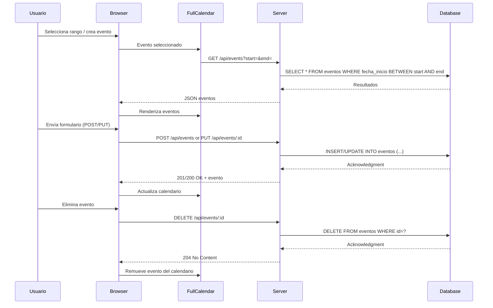

# Calendario Interactivo

## Visión General del Proyecto
El proyecto es una aplicación web de calendario interactivo que permite a los usuarios crear, editar y eliminar eventos directamente desde la interfaz gráfica. Utiliza **FullCalendar** para la visualización y gestión de eventos, **Bootstrap 5** para el diseño responsivo y un backend RESTful expuesto bajo `/api/events`. La lógica del cliente se escribe en JavaScript puro, sin frameworks adicionales.

- **Front‑end**: HTML + CSS (Bootstrap) + JS.
- **Back‑end**: No incluido en el volcado; se asume que responde a los endpoints mencionados y devuelve/recibe JSON con la estructura de eventos (`id`, `titulo`, `descripcion`, `fecha_inicio`, `fecha_fin`, `color`).
- **Persistencia**: Se espera que el backend maneje la base de datos, mientras el cliente solo consume la API.

## Arquitectura del Sistema
```mermaid
graph TD
    A[Usuario] -->|Interacción UI| B[Browser]
    B --> C{FullCalendar}
    B --> D{Bootstrap Modals}
    C --> E[API /api/events (REST)]
    D --> E
    E --> F[Servidor Node/Express (o equivalente)]
    F --> G[Base de Datos SQL/NoSQL]
```

- **Cliente**: Renderiza el calendario y gestiona eventos locales.
- **Servidor**: Expose CRUD sobre `/api/events`.
- **Base de datos**: Almacena los eventos con campos mencionados.

### Componentes Clave
| Componente | Responsabilidad |
|------------|-----------------|
| `index.html` | Estructura del UI, incluye FullCalendar y Bootstrap. |
| `<script>` interno | Inicializa el calendario, gestiona modales y llamadas API. |
| `/api/events` | Endpoints REST: `GET`, `POST`, `PUT`, `DELETE`. |

## Endpoints de la API
| Método | Ruta | Parámetros | Cuerpo | Respuesta | Descripción |
|--------|------|------------|--------|-----------|-------------|
| **GET** | `/api/events?start=YYYY-MM-DD&end=YYYY-MM-DD` | `start`, `end` (opcional) | N/A | `200 OK` <br> JSON array de eventos | Recupera todos los eventos dentro del rango. |
| **POST** | `/api/events` | N/A | `{ titulo, descripcion, fecha_inicio, fecha_fin, color }` | `201 Created` <br> JSON evento creado | Crea un nuevo evento. |
| **PUT** | `/api/events/:id` | `:id` | `{ titulo?, descripcion?, fecha_inicio?, fecha_fin?, color? }` | `200 OK` <br> JSON evento actualizado | Actualiza un evento existente. |
| **DELETE** | `/api/events/:id` | `:id` | N/A | `204 No Content` | Elimina el evento especificado. |

### Ejemplo de Payload
```json
{
  "titulo": "Reunión de equipo",
  "descripcion": "Discusión sobre el proyecto X",
  "fecha_inicio": "2025-08-20T10:00:00Z",
  "fecha_fin": "2025-08-20T11:00:00Z",
  "color": "#ff0000"
}
```

## Instrucciones de Instalación y Ejecución
1. **Clonar el repositorio**  
   ```bash
   git clone https://github.com/tuusuario/calendario-interactivo.git
   cd calendario-interactivo
   ```

2. **Instalar dependencias del backend** (ejemplo con Node.js)  
   ```bash
   npm install express cors body-parser sqlite3
   ```

3. **Crear la base de datos** (si usa SQLite)  
   ```bash
   node init-db.js  # script que crea la tabla `eventos`
   ```

4. **Iniciar el servidor**  
   ```bash
   node server.js
   ```

5. **Abrir el cliente**  
   Navega a `http://localhost:3000/index.html` (o el puerto configurado).

> **Nota:** Asegúrate de que la ruta `/api/events` esté disponible y que los CORS estén correctamente configurados.

## Flujo de Datos Clave


## Extensiones Futuras (Opcional)
| Área | Posible Mejora |
|------|----------------|
| **Autenticación** | Implementar JWT para proteger los endpoints. |
| **Notificaciones** | WebSocket o SSE para notificar cambios en tiempo real a múltiples clientes. |
| **Export/Import** | Permitir exportar eventos a iCal (.ics) y importar desde archivos. |
| **Recurrencia** | Soporte de eventos recurrentes (FullCalendar `rrule`). |
| **UI Enhancements** | Añadir filtros por color, búsqueda avanzada y vistas personalizadas. |

---