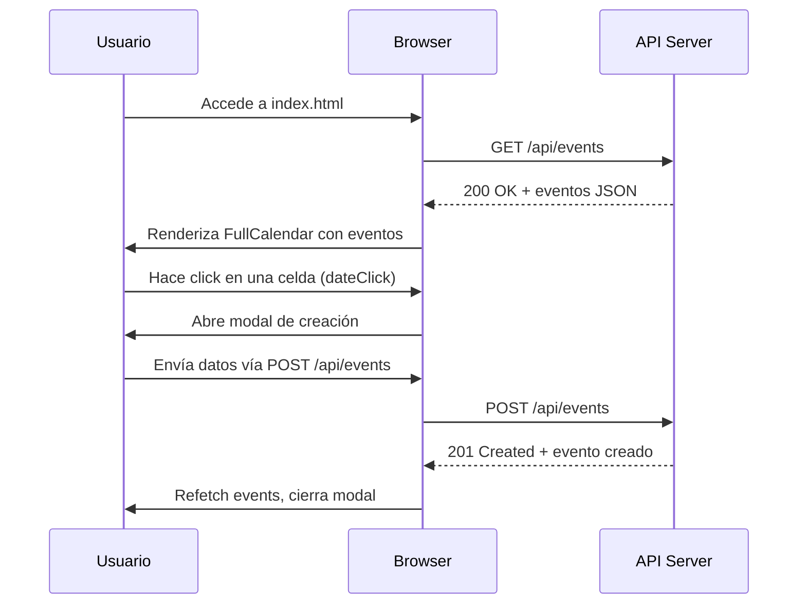
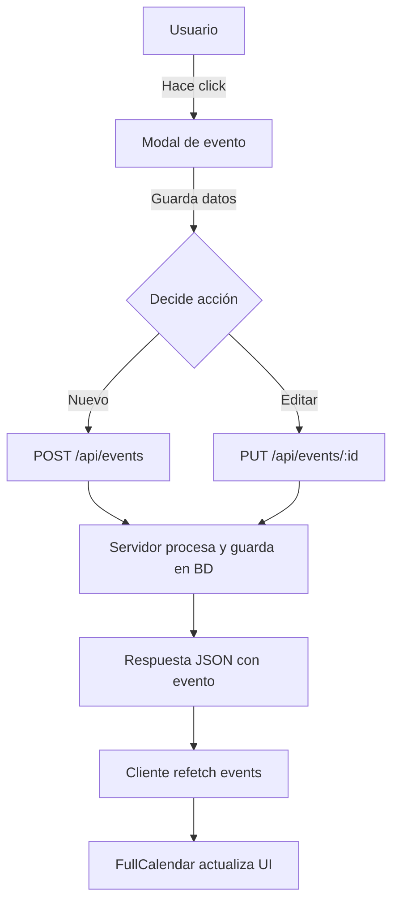

# Visión General del Proyecto

El proyecto es una **aplicación web de calendario interactivo** que permite a los usuarios crear, editar y mover eventos dentro de un calendario visual. La interfaz se construye con **FullCalendar**, una librería JavaScript popular para la representación de calendarios en el navegador. El front‑end está contenido en un único archivo `index.html` que incluye tanto el HTML como los estilos CSS y el script JavaScript necesario para interactuar con la API RESTful.

El flujo típico del usuario es:

1. **Visualizar** eventos cargados desde `/api/events`.
2. **Crear** un nuevo evento haciendo clic en una celda vacía o pulsando el botón de “Nuevo Evento”.
3. **Editar** un evento existente haciendo clic sobre él.
4. **Mover** eventos arrastrándolos a otra fecha/hora; la posición actual se persiste mediante una solicitud `PUT` al endpoint correspondiente.

El back‑end no está incluido en el volcado, pero los endpoints REST que utiliza están claramente definidos en el código JavaScript y serán descritos detalladamente en la sección de *Endpoints de la API*.

---

# Arquitectura del Sistema

La arquitectura sigue un patrón **cliente‑servidor** simple:

```
┌───────────────────────┐
│  Navegador (Cliente)  │
│  index.html            │
└─────────────▲─────────┘
              │
              │ HTTP/REST
              ▼
┌───────────────────────┐
│    API RESTful         │
│  /api/events (GET,POST)│
│  /api/events/:id (PUT) │
└───────────────────────┘
```

## Componentes Clave

| Componente | Responsabilidad |
|------------|-----------------|
| **FullCalendar** | Renderiza el calendario y gestiona eventos UI. |
| **Modal de evento** | Interfaz para crear/editar eventos. |
| **Script JavaScript** | Lógica de negocio: carga, creación, actualización y re‑renderizado de eventos. |
| **API `/api/events`** | Persistencia de datos (no incluida en el volcado). |

### Diagrama Mermaid



---

# Endpoints de la API

| Método | Ruta | Parámetros | Cuerpo (JSON) | Respuesta |
|--------|------|------------|---------------|-----------|
| **GET** | `/api/events` | `start`, `end` (opcional, ISO 8601) | — | `200 OK` + array de eventos |
| **POST** | `/api/events` | — | ```json{ "titulo":"Evento", "descripcion":"Desc", "color":"#ff0000", "fecha_inicio":"2025-08-15T10:00", "fecha_fin":"2025-08-15T11:00" }``` | `201 Created` + evento creado |
| **PUT** | `/api/events/:id` | `id` en la URL | ```json{ "titulo": "...", "descripcion":"...", "color":"#xxxxxx", "fecha_inicio":"...", "fecha_fin":"..." }``` | `200 OK` + evento actualizado |

> **Nota:** Los endpoints son consumidos por el script JavaScript mediante llamadas `fetch`. En caso de error, la API debe devolver un objeto JSON con la propiedad `error`.

---

# Instrucciones de Instalación y Ejecución

1. **Clonar el repositorio** (o descargar los archivos)  
   ```bash
   git clone https://github.com/tu-usuario/calendario-interactivo.git
   cd calendario-interactivo
   ```

2. **Instalar dependencias del back‑end** (ejemplo con Node.js + Express)  
   ```bash
   npm install express cors body-parser uuid
   ```

3. **Crear el archivo `server.js`** con la implementación básica de los endpoints (ver ejemplo en la sección *Extensiones Futuras*).

4. **Iniciar el servidor**  
   ```bash
   node server.js
   ```

5. **Abrir el navegador** y navegar a `http://localhost:3000/index.html`.

> Si prefieres servir el archivo estático con un servidor simple, puedes usar `npx http-server` en la raíz del proyecto.

---

# Flujo de Datos Clave



- **Carga inicial**: `GET /api/events?start=YYYY-MM-DD&end=YYYY-MM-DD` devuelve todos los eventos del mes visible.
- **Creación/Actualización**: Se envía un objeto JSON con los campos requeridos. La respuesta incluye el evento con su identificador generado.
- **Arrastre de eventos** (`eventDrop`) actualiza solo las fechas de inicio y fin mediante `PUT`.

---

# Extensiones Futuras

| Área | Posible Mejora |
|------|----------------|
| **Persistencia real** | Implementar una base de datos (SQLite, MongoDB) para almacenar eventos. |
| **Autenticación** | Añadir JWT o sesiones para que cada usuario tenga su propio calendario privado. |
| **Notificaciones** | Enviar correos electrónicos o notificaciones push cuando se cree/edite un evento. |
| **Roles y permisos** | Permitir solo a ciertos usuarios editar eventos de otros. |
| **Exportación** | Generar archivos iCal (.ics) para importar en otras aplicaciones. |

Estas extensiones pueden integrarse sin modificar la interfaz existente, simplemente ampliando los endpoints y añadiendo lógica al front‑end cuando sea necesario.