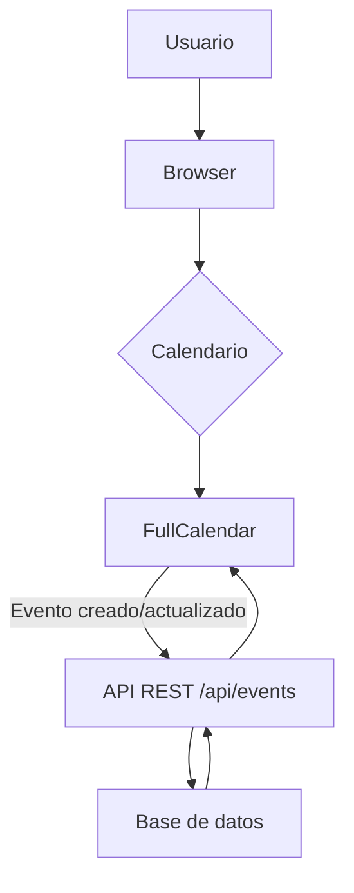
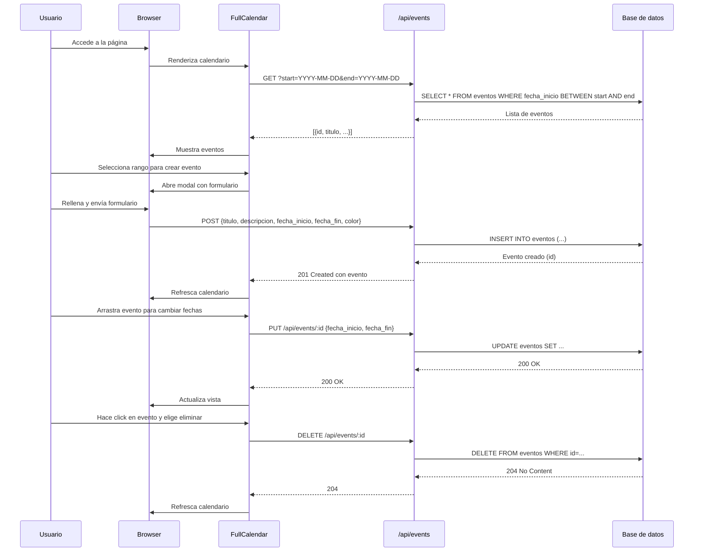

# Visión General del Proyecto

El proyecto es una **aplicación web de calendario interactivo** que permite a los usuarios crear, editar y eliminar eventos directamente desde el navegador. La interfaz utiliza Bootstrap 5 para estilos responsivos y FullCalendar v6 para la visualización de calendarios. Los datos se persisten mediante un backend RESTful expuesto en `/api/events`, aunque el código fuente del servidor no está incluido en el volcado; por lo tanto, se asume que existe una API con los endpoints típicos (`GET`, `POST`, `PUT`, `DELETE`).

El flujo típico de interacción es:

1. El usuario abre la página y ve un calendario mensual.
2. Al hacer clic o arrastrar, se muestra un modal para crear/editar eventos.
3. Los cambios se envían al backend mediante llamadas `fetch`.
4. La vista del calendario se actualiza automáticamente con `calendar.refetchEvents()`.

El proyecto está pensado como una SPA ligera sin framework JavaScript adicional (React/Vue), lo que facilita su despliegue en cualquier servidor web estático.

---

# Arquitectura del Sistema

## Componentes Principales

| Componente | Descripción | Tecnologías |
|------------|-------------|-------------|
| **Front‑end** | HTML, CSS (Bootstrap 5), JavaScript puro. Renderiza el calendario y gestiona la interacción con el usuario. | Bootstrap 5, FullCalendar v6 |
| **API REST** | Servicio que expone CRUD de eventos. Se comunica con el front‑end vía `fetch`. | HTTP/JSON (asumido) |
| **Persistencia** | Base de datos relacional o NoSQL donde se guardan los eventos. | No especificado |

## Diagrama de Flujo



---

# Endpoints de la API

> **Nota:** Los nombres de los campos siguen la convención `snake_case` en el payload JSON.

| Método | Ruta | Parámetros | Descripción | Respuesta |
|--------|------|------------|-------------|-----------|
| `GET` | `/api/events` | `start`, `end` (opcional) | Obtiene eventos dentro del rango. Si no se especifican, devuelve todos los eventos. | `200 OK` con array de objetos `{ id, titulo, descripcion, fecha_inicio, fecha_fin, color }`. |
| `POST` | `/api/events` | JSON payload | Crea un nuevo evento. | `201 Created` con el objeto creado. |
| `PUT` | `/api/events/:id` | JSON payload (puede contener solo campos a actualizar) | Actualiza el evento especificado. | `200 OK` con el objeto actualizado. |
| `DELETE` | `/api/events/:id` |  | Elimina el evento. | `204 No Content`. |

### Ejemplo de Payload

```json
{
  "titulo": "Reunión de equipo",
  "descripcion": "Discusión sobre el proyecto X",
  "fecha_inicio": "2025-08-20T10:00:00Z",
  "fecha_fin":   "2025-08-20T11:00:00Z",
  "color": "#ff0000"
}
```

---

# Instrucciones de Instalación y Ejecución

1. **Clonar el repositorio**  
   ```bash
   git clone https://github.com/tuusuario/calendario-interactivo.git
   cd calendario-interactivo
   ```

2. **Instalar dependencias del backend (si aplica)**  
   Si tienes acceso al código del servidor, instala las dependencias y configura la base de datos. Por ejemplo, con Node.js:  
   ```bash
   npm install
   ```

3. **Configurar variables de entorno**  
   Crea un archivo `.env` con la URL base de la API (si es diferente a `/api/events`). Ejemplo:  
   ```
   API_BASE_URL=http://localhost:3000/api/events
   ```

4. **Iniciar el servidor backend**  
   ```bash
   npm start
   ```

5. **Servir los archivos estáticos**  
   Puedes usar cualquier servidor HTTP simple, por ejemplo:  
   ```bash
   npx serve .
   ```
   O bien, si el backend también sirve la página, simplemente abre `http://localhost:3000`.

6. **Abrir en el navegador**  
   Navega a `http://localhost:5000` (o al puerto configurado) y deberías ver el calendario interactivo.

---

# Flujo de Datos Clave



---

# Extensiones Futuras

| Área | Posible Mejora |
|------|----------------|
| **Autenticación** | Implementar login con JWT para proteger los endpoints y asociar eventos a usuarios. |
| **Calendarios múltiples** | Permitir que un usuario vea varios calendarios (personal, trabajo) y mezcle sus eventos. |
| **Notificaciones** | Enviar correos o mensajes push cuando se cree/actualice un evento cercano. |
| **Exportación** | Añadir opciones para exportar eventos a iCal (.ics) o CSV. |
| **Modo de vista avanzada** | Agregar vistas `timeGridWeek` y `timeGridDay` con soporte para horarios precisos. |

---